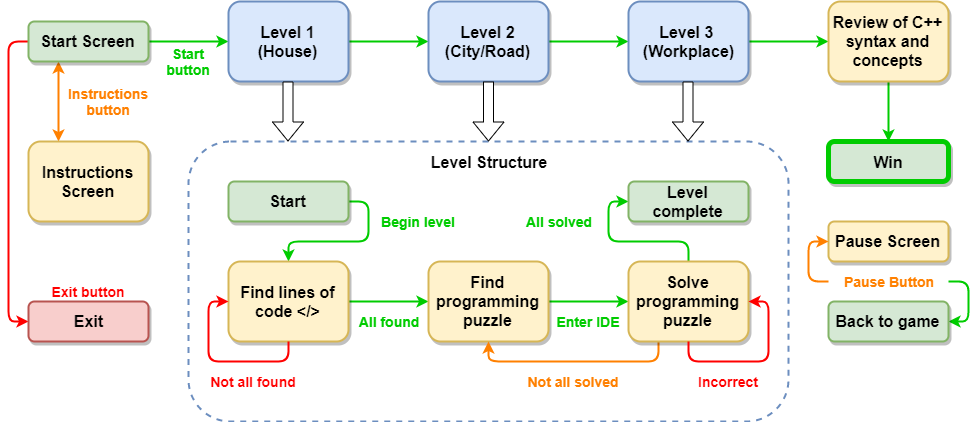

## `i++` is a platformer game where the player has to complete challenges by solving `C++` programming puzzles

Originally created as a CISC/CMPE 320 final project in collaboration with:
- Evan Latsky ([@evanlatsky](https://github.com/evanlatsky))
- Daniel Lok ([@DannLK](https://github.com/DannLK))
- Katy Scott
- Jonathan Stroz  ([@15jas11](https://github.com/15jas11))
- Steven Ta  ([@stevenleta](https://github.com/stevenleta))

**Directory Structure:**

`i++/Code`
 
Contains the actual code for the main project

`i++/Platforms`
 
Contains the actual project files for the main project (separate for Windows (CodeLite) and Mac (Eclipse))

`i++/External Libraries`
 
Contains the external library files required for the main project (separate for Windows and Mac (SFML and SFGUI))

`i++/Resources`
 
Contains all the non-code assets for the main project (graphics and others)

`i++/Other`
 
Contains other related non-code files that are not part of the main project (Class diagram and screenshots)

The original overview of the game (created when the project was started) is shown in the diagram below:

When the project was moved to this repository, the original commits were not transferred.
However, the branch history is shown below as a reminder of all the hard work that was put into this project by all the team members mentioned above:

